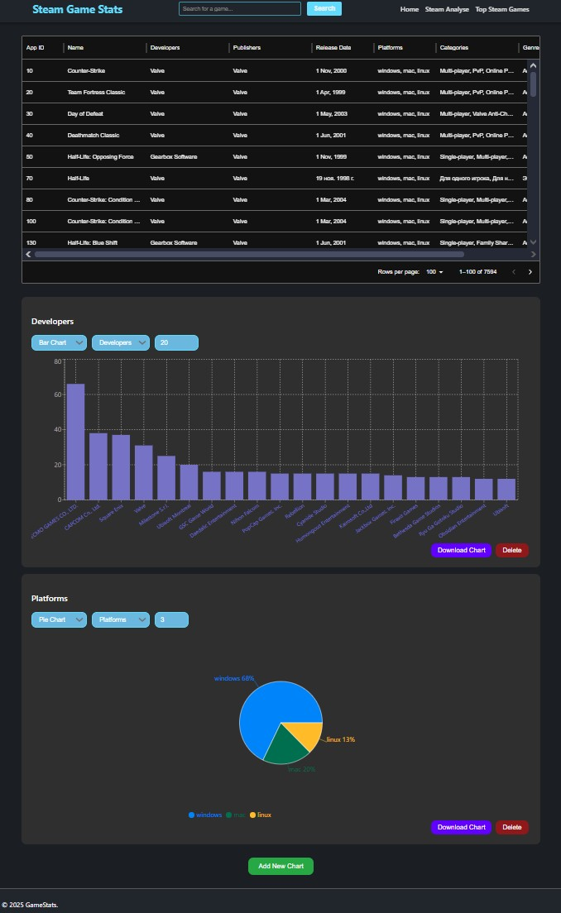
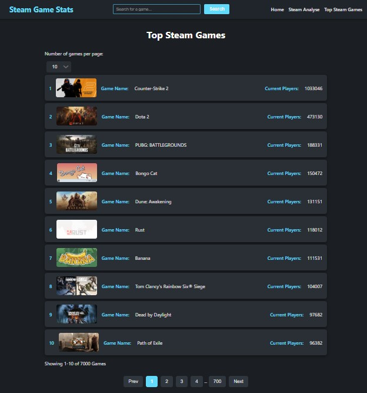
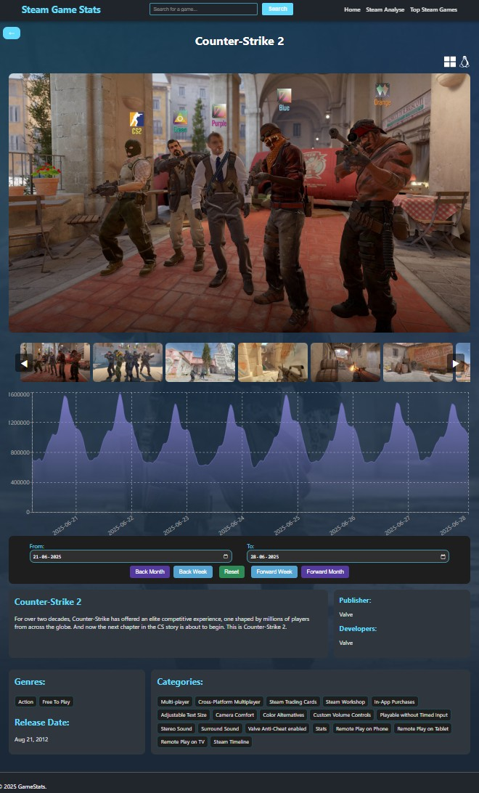
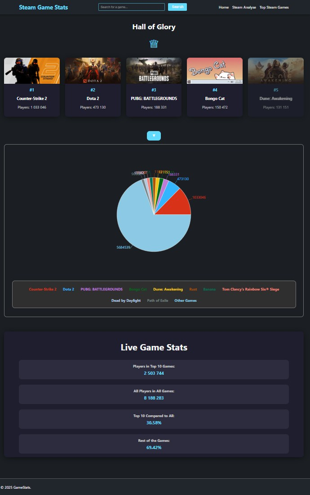

# 🎮 Steam Game Stats

[Check out the GameStats ~ 10s cold start](https://marekvaris.github.io/GameStats/)

This project is a full-stack web application designed to explore and analyze Steam game data. The frontend is built with React and TypeScript, providing a responsive and interactive user interface that displays top Steam games, detailed game information, and comprehensive data visualizations. The backend serves Steam game data using Google BigQuery for analytics and is deployed on Google Cloud Run, enabling a scalable, serverless API. 🚀

---

## 🔍 How It Works

The frontend fetches Steam game data from a REST API running on Google Cloud Run. This API queries Google BigQuery, which stores and processes large datasets of Steam game metadata and player counts. The app features:

- 📄 A paginated list of top Steam games by concurrent players, where users can select how many games to view per page.
- 🎯 Detailed pages for each game, showing screenshots, descriptions, developer and publisher info, release dates, genres, platforms, and an interactive player count history chart.
- 📊 An analysis section with customizable bar and pie charts that summarize data such as the most common developers, platforms, categories, and genres across all Steam games in the dataset.
- 💾 The ability to download charts as images for offline use or reporting.

---

## 🛠️ Technologies Used

- **Frontend**: React ⚛️ with TypeScript 📝, React Query for data fetching and caching, React Router for routing, and html2canvas for exporting charts as images + Basic CSS for styling.
- **Backend**: Google Cloud Run ☁️ hosts a serverless API that connects to Google BigQuery, which manages the large-scale Steam game dataset.
  
This architecture allows efficient querying of large datasets with minimal latency, while delivering a smooth, modern frontend experience.

---

## 🖼️ Screenshots

  
  
  
  

---

## 💡 Why This Project

This project showcases the ability to build a full-stack application that handles real-world data challenges—large datasets, API performance, and interactive visualizations. It leverages modern frontend development best practices with React and TypeScript, coupled with powerful cloud-native backend services on Google Cloud Platform.

It demonstrates skills in:

- 🎨 Frontend UI/UX design and data visualization.
- ⚡ Asynchronous data fetching and state management.
- ☁️ Cloud infrastructure deployment and serverless APIs.
- 📊 Data engineering with BigQuery.

